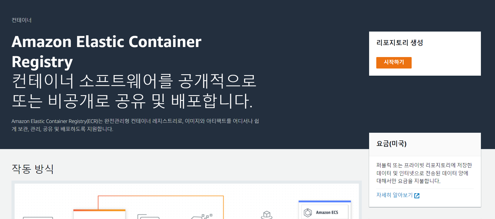

# CloudWatch EC2 모니터링 (feat.Grafana)

CloudWatch는 AWS의 모니터링 시스템으로 다양한 서비스 및 인스턴스를 모니터링하고 그래프를 그릴 수 있도록 한다.

우리가 EC2를 생성하면 기본적으로 매트릭이 구성되는데, 아쉽게도 **`메모리와 디스크 사용량`**에 대해서는 제공하지 않고 있다. 그래서 CloudWatch Agent를 통해서 해당 메트릭을 수집할 수 있도록 한다.

참고로 CloudWatch의 수집 매트릭은 여기서 확인 가능하다.

**순서**

1. IAM 역할 생성
2. EC2에 역할 부여
3. EC2에 CloudWatch Agent 설치
4. CloudWatch Agent 연동
5. Grafana 연동

## 1. IAM 역할 생성

IAM 역할은 EC2 인스턴스에서 AWS service에 접근할 수 있도록 역할을 생성합니다.

**IAM > 역할 > \[역할만들기] 클릭**

<figure><figcaption></figcaption></figure>

AWS 서비스, EC2 선택

<figure><figcaption></figcaption></figure>

정책 필터에서 CloudWatchAgentServerPolicy를 선택

<figure><figcaption></figcaption></figure>

역할 이름 작성, \[역할 만들기] 클릭

## 2. EC2에 역할 부여

생성한 IAM 역할을 EC2에 등록해 줍니다.

## 3. EC2에 CloudWatch Agent 설치

CloudWatch Agent를 설치하면, Agent가 직접 메트릭을 수집하여 AWS 서비스로 전송합니다. 이를 통해서 CloudWatch에서 해당 메트릭 값을 확인할 수 있게 됩니다.

## 4. CloudWatch Agent 연동

Agent 또한 데몬 형태로 계속 돌아야하기 때문에 설치 후 config를 구성하고 실행하는 절차가 필요합니다.

## 5. CloudWatch DashBoard 확인 및 Grafana 연동

CloudWatch DashBoard에서도 메트릭 조회가 가능하지만 Grafana를 연동해 가시화를 더욱 극대화 시키도록 하겠습니다.

\---

참고 : [https://velog.io/@yeziwoo/EC2-CloudWatch-Agent](https://velog.io/@yeziwoo/EC2-CloudWatch-Agent)

